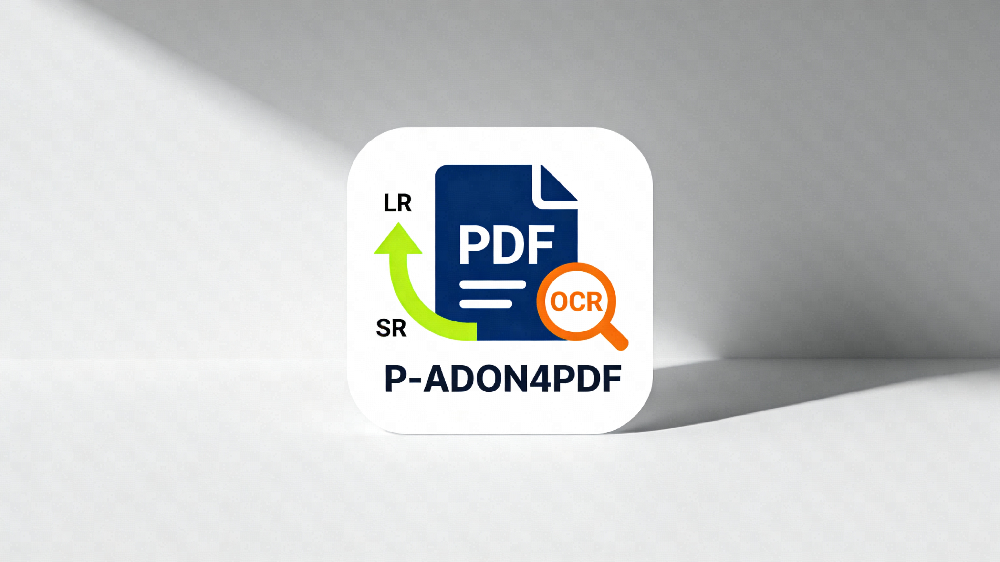
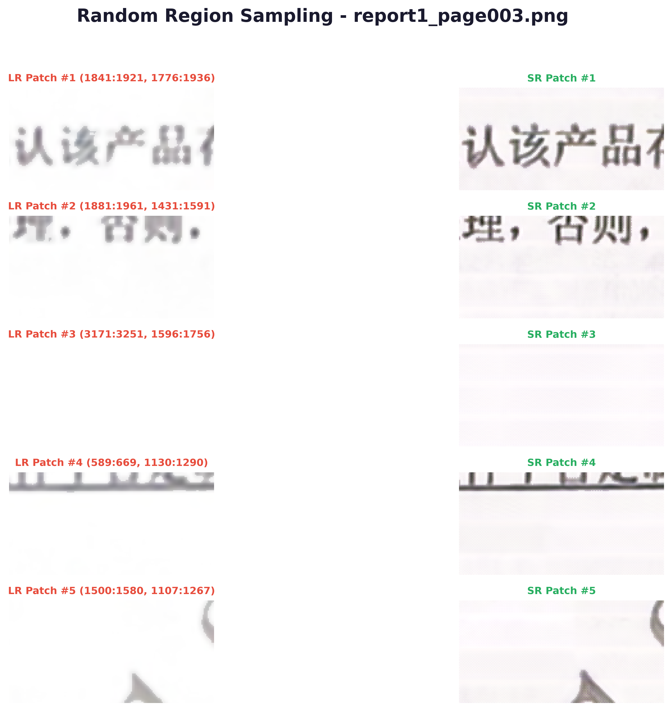
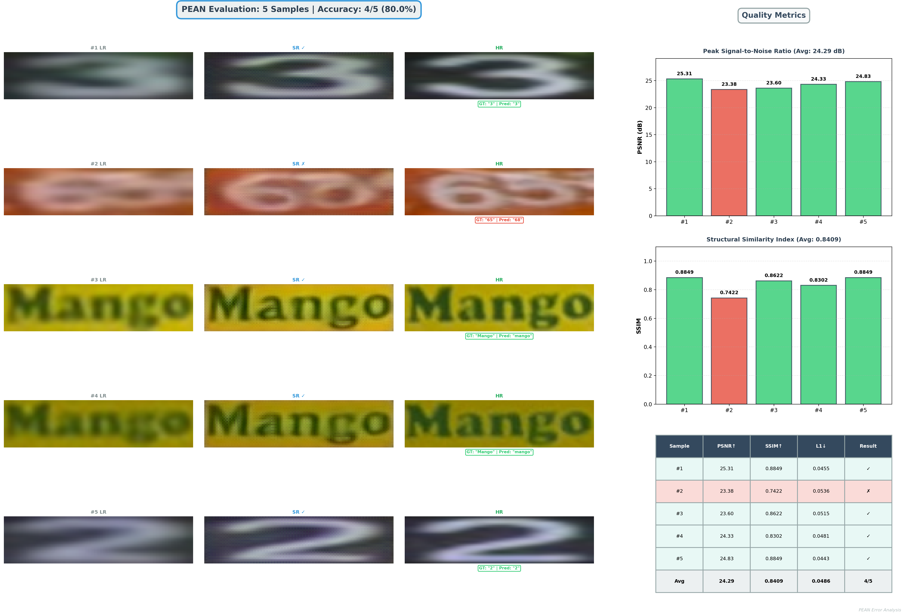

# P-ADON4PDF: Prior-enhanced Attention Document OCR Network for Image-to-Structure 
    

> Generated by AI tools, but double-check by humans afterwards

*update 2025/11/20: Minghao Lee 
(email: t330034027@mail.uic.edu.com)*



Check Fast: Let's See the Effect of our work.

| LR 👉 SR PDF | Explanation |
|---|---|
|  | Visualization of LR v.s. SR PDF and sample details are shown. Heatmap shows that the detail structure of chars are focused.|

| Sample PDF Detail | Explanation |
|---|---|
|  | Visualization of LR v.s. SR PDF and sample details are shown. It's ramdomly sampled from all concerns of the IMG|

| TextZoom Dateset Test| Explanation |
|---|---|
|  | Randomly sample from TextZoom in 'easy' part and based on 'basic' OCR. So, the original method of OCR has large var in different test, although the IMG is clearer, So, let's see our New OCR!|
| | Randomly sample from TextZoom in 'easy' part and based on 'basic' OCR. So, the original method of OCR has large var in different test, although the IMG is clearer, So, let's see our New OCR!|


本仓库增加了 PDF 文本修复功能。有任何问题，欢迎联系 Minghao Lee。


## 1. 环境配置 (Env Config)

    

### 1.1 搭建环境 (Windows Version + Conda)

本项目提供了两种环境设置方式，请选择其中一种 (window 推荐 miniconda 来维护虚拟环境更好，选第一个)：

#### 1.1.1 选项 A: 从 `environment.yml` 创建 Conda 环境 (推荐)

这种方式会创建一个完整的 Conda 环境，包含所有依赖项：

```powershell
# 删除旧环境（如果存在）
conda env remove -n pean
# 从环境文件创建新环境
conda env create -f .\environment.yml
# 激活环境
conda activate pean
# 验证 PyTorch 安装
python -c "import torch; print(torch.__version__, torch.version.cuda, torch.cuda.is_available())"
```

#### 1.1.2 选项 B: 使用 pip 安装 (备选方案, 优先考虑上一个)

如果 Conda 环境创建失败，可以使用 pip 安装：

```powershell
# 首先创建一个基础 Conda 环境
conda create -n pean python=3.8
# 激活环境
conda activate pean
# 使用 pip 安装依赖
pip install -r .\requirements.txt
# 验证安装
python -c "import torch; print(torch.__version__, torch.version.cuda, torch.cuda.is_available())"
```

### 1.2 详细配置说明 （about env.）

更详细的环境配置信息请参考 **`ENVIRONMENT_Setting.md` 文件**，该文件包含：
- 所有依赖包的详细说明
- 包的分类与用途
- CUDA 和 PyTorch 的版本信息
- 常见问题排查方法

## 2. 数据集和预训练识别器

### 2.1 数据集下载

- 从以下链接下载 TextZoom 数据集: https://github.com/JasonBoy1/TextZoom
- <mark> 将数据集放置在<mark>
-  `./data/TextZoom/` 目录下

### 2.2 预训练识别器下载 （Must ALL Download）

本项目支持多种文本识别器，请根据需要下载：

- **ASTER**: https://github.com/ayumiymk/aster.pytorch
- **CRNN**: https://github.com/meijieru/crnn.pytorch
- **MORAN**: https://github.com/Canjie-Luo/MORAN_v2
- **PARSeq**: https://github.com/baudm/parseq

- <mark> 预训练的识别器权重应放置在 <mark>
- `./recognizers/` 目录下

### 2.3 配置文件修改 （Look at path !）

在使用前，**必须** 修改 `./config/super_resolution.yaml` 配置文件，根据你的实际路径设置：
- 数据集的路径
- 识别器的路径
- 其他模型参数

例如：
```yaml
dataset_path: "./data/TextZoom"
recognizer_path: "./recognizers"
```


### 2.4 模型权重 （Skipping Done!）

#### 2.4.1 提供的模型权重 （已经下好）

本项目提供了以下预训练模型权重：

- **PEAN_final.pth**: 完整 PEAN 模型的最终权重
- **TPEM_final.pth**: Transformer 先验增强模块的权重
- **PEAN_pretrained.pth**: 预训练版本（可选）

#### 2.4.2 权重下载 （已经下好）

可从以下位置下载权重文件：

- **百度网盘**: https://pan.baidu.com/s/1Bu2WdoZ1gIfHz8JRujVq9w，密码: nr2n
- **Google Drive**: https://drive.google.com/file/d/1kGhPN2wUCV12Cu4yX4WGgMer3U9sNNPu/view?usp=sharing

#### 2.4.3 权重放置位置 (已经下好)

将下载的权重文件放置在 `./ckpt/` 目录下：

```
./ckpt/
  ├── PEAN_final.pth
  ├── TPEM_final.pth
  └── log.csv
```

### 2.4.4 检查点命名约定 (已经下好)

从最新版本开始，所有模型检查点都遵循标准化的命名约定，便于组织和查找：

- **最佳模型**: `{MODEL}_{metric}_{epoch}.pth`（例如：`PEAN_easy_aster_5.pth`、`SWINIR_sum_crnn_12.pth`）
- **定期检查点**: `{MODEL}_checkpoint_epoch{X}_iter{Y}.pth`（例如：`PEAN_checkpoint_epoch3_iter1500.pth`）
- **最终最佳模型**: `{MODEL}_final.pth`（例如：`PEAN_final.pth`、`SWINIR_final.pth`、`TPEM_final.pth`）


---

## 3. 训练和测试 (Train & Test)

### 3.1 模型训练

根据论文所述，该模型的训练包括两个阶段：**预训练**（可选）和**微调**。

#### 阶段 1: 预训练（Additional）

如果要进行预训练，使用以下命令：

```powershell
python main.py --batch_size="32" --mask --rec="aster" --srb="1" --pre_training
```

预训练的权重将保存在 `./ckpt/checkpoint.pth`。

#### 阶段 2: 微调 (Fine-tunning Train)

假设预训练的权重保存在 `./ckpt/checkpoint.pth`，使用以下命令进一步训练：

```powershell
# 单条训练
# python main.py --batch_size="32" --mask --rec="aster" --srb="1" --resume="./ckpt/checkpoint.pth"

# powershell
# 优化成多模型对比训练
# change the batch_size to 64? / no more than 64
python main_comparison.py --batch_size=8 --mask --rec="aster" --srb=1
```

**注意**：预训练阶段是可选的。你也可以直接训练完整模型，跳过预训练。在训练前，请修改 `./config/cfg_diff_prior.json` 中的 "checkpoint" 字段，设置为保存 TPEM 检查点的目录。

Transformer 型识别器（用于 SFM 损失函数）可从以下链接下载：
[https://github.com/FudanVI/FudanOCR/tree/main/text-gestalt](https://github.com/FudanVI/FudanOCR/tree/main/text-gestalt)

---

### 3.2 模型测试 (Eval)

#### (Additonal) 测试预训练模型

假设 TextZoom 数据集的 easy 子集保存在 `/root/dataset/TextZoom/test/easy`，使用以下命令（按需调整文件路径）：

```powershell
python main.py --batch_size="32" --mask --rec="aster" --srb="1" --resume="./ckpt/PEAN_final.pth" --pre_training --test --test_data_dir="/root/dataset/TextZoom/test/easy"
```

#### (After Training) 测试微调后的完整模型

假设微调后的权重保存在 `./ckpt/PEAN_final.pth`，TPEM 训练的权重保存在 `./ckpt/TPEM_final.pth`：

1. 首先修改 `./config/cfg_diff_prior.json` 中的 "resume_state" 为 `./ckpt/TPEM_final.pth`

2. 然后使用以下命令进行测试：

```powershell
python main.py --batch_size="32" --mask --rec="aster" --srb="1" --resume="./ckpt/PEAN_final.pth" --test --test_data_dir="/root/dataset/TextZoom/test/easy"
```

### 3.3 命令行参数说明

- `--batch_size`: 批量大小（根据 GPU 内存调整）
- `--mask`: 是否使用掩码
- `--rec`: 使用的识别器类型（aster, crnn, moran, parseq）
- `--srb`: 超分支块数
- `--pre_training`: 是否进行预训练
- `--resume`: 恢复检查点的路径
- `--test`: 是否进行测试
- `--test_data_dir`: 测试数据集的路径

## 4. Demo: 演示和推理

### 4.1 运行 PEAN Demo（图像超分）

本项目提供了简单的 demo 脚本来对单张图像进行超分辨率处理。

#### 4.1.1 准备 demo 物料（or 直接作为 block 接入到别的模型框架中）

##### - For LR IMG 👉 `./demo_img/`
1. 将需要处理的图像放在 `./demo_img/` 目录下（支持 JPEG、PNG 等格式）
2. 每张图像应该是低分辨率的文本图像

##### - For LR PDF 👉 `./demo_pdf/`
将需要处理的 PDF 放在 `./demo_pdf/` 目录下

#### 4.1.2 Run Demo (不同版本手动调整)

- demo1: 普通的照片版 （设定 --input_type & --demo_dir）
```powershell
# 激活 Conda 环境
conda activate pean
# 默认照片版 input
# 运行演示脚本（将处理 demo_img 目录中的所有图像）
python run_demo.py --input_type img --demo_dir ./demo_img
```

- demo2: PDF 版本（设定 --input_type & --demo_dir）
```powershell
# powershell
# 选下面一条跑就行：
# 运行演示脚本（将处理 demo_pdf 目录中的所有PDF）
.\4RUN_demo.ps1

# 或者 (本质：上面那个 ps1 包装的是如下：)
python run_demo.py --input_type pdf --demo_dir ./demo_pdf --out_dir ./demo_pdf_results --pdf_dpi 150
```

#### 4.13 Demo Output

##### - IMG Version
- 自动读取 `./demo_img/` 目录中的所有图像
- 总对比输出路径: `./demo_results/demo_[时间戳]/`
- 单独HR输出路径：`demo_single_HR/`: **单独保存的高分辨率（HR/SR）图像**

##### - PDF Version
- 自动读取 `./demo_pdf/` 目录中的所有 PDF
- 总对比输出路径: `./demo_pdf_results/demo_[时间戳]/`
- 单独HR输出路径：`demo_single_HR/`: **单独保存的高分辨率（HR/SR）图像**


## 5. Eval: 模型评估

### 5.1 运行完整评估

本项目提供了完整的评估脚本，可以在标准数据集上评估模型性能。

#### 5.2 评估 PEAN 模型

```powershell
# 激活环境
conda activate pean
# 在 TextZoom easy 子集上评估
# 可以按需调整 batch_size
python run_eval_comparison.py --rec="aster" --batch_size=8 --test_data_dir="./data/TextZoom/test/easy"
```

#### 5.3 评估 SwinIR 模型（对比基准）

```powershell
# 评估 SwinIR 模型
python run_eval_comparison.py --model="swinir" --rec="crnn" --batch_size=8 --test_data_dir="./data/TextZoom/test/easy"
```

#### 5.4 评估参数说明

- `--rec`: 使用的识别器（aster, crnn, moran, parseq）
- `--batch_size`: 批量大小
- `--test_data_dir`: 测试数据集路径
- `--model`: 模型类型（pean, swinir）

#### 5.5 评估输出

评估完成后，结果保存在 `./eval_results/` 目录下，包括：

- **metrics.csv**: 详细的质量指标
  - PSNR: 峰值信噪比
  - SSIM: 结构相似度
  - 识别准确率（根据使用的识别器）
  - 处理时间

- **summary.txt**: 评估摘要
  - 平均指标
  - 最优/最差样本
  - 性能统计

- **heatmaps/**: 热力图可视化
- **images/**: 对比图像

### 6. 模型对比评估

为了更好地了解不同模型的性能差异，可以运行对比评估：

```powershell
# 运行 PEAN 和 SwinIR 的对比评估
python run_eval_comparison.py --compare_models --rec="crnn" --batch_size=8
```

这将生成详细的对比报告，包括：
- 各模型的性能指标对比
- 处理速度对比
- 内存占用对比

---


## 致谢

本项目的框架继承自以下优秀项目，在此表示衷心感谢：

- [TATT](https://github.com/mjq11302010044/TATT) - 文本超分基础框架
- [SR3](https://github.com/Janspiry/Image-Super-Resolution-via-Iterative-Refinement) - 扩散模型超分方法
- [Stripformer](https://github.com/pp00704831/Stripformer) - 条纹去除技术

## 推荐阅读

本项目的作者借鉴了相关作品，推荐阅读：

- **[DPMN]** - 场景文本图像超分辨率的首项工作，已被 AAAI 2023 录用。[[论文]](https://arxiv.org/abs/2302.10414) [[代码]](https://github.com/jdfxzzy/DPMN)
- **[GSDM]** - 文本图像修复的有趣工作，已被 AAAI 2024 录用。提出了使用结构预测模块和基于扩散的重建模块完成这项任务。[[论文]](https://arxiv.org/abs/2401.14832) [[代码]](https://github.com/blackprotoss/GSDM)


---

**最后更新**: 2025 年 12 月 6 日  
**维护者**: Minghao Lee (t330034027@mail.uic.edu.com)
